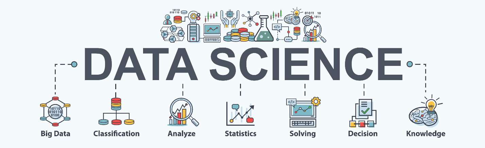
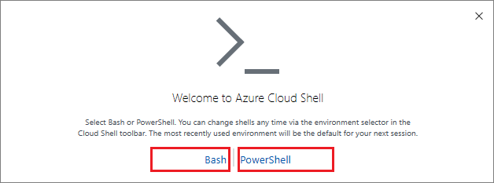

# [Azure Machine Learning R Examples - Predicting Remaining Useful Life of TurboFan](../README.md)



## 1. Getting Started

- [Azure Machine Learning R Examples - Predicting Remaining Useful Life of TurboFan](../README.md)
  - [1. Getting Started](#1-getting-started)
    - [1.1 Azure Portal](#11-azure-portal)
      - [1.1.1 Do you have Enough Cores?](#111-do-you-have-enough-cores)
    - [1.2 Using Cloud Shell](#12-using-cloud-shell)
    - [1.3 Create a Resource Group](#13-create-a-resource-group)
      - [1.3.1 Resource Group - Use Azure CLI](#131-resource-group---use-azure-cli)
      - [1.3.2 Resource Group - Use Azure Portal](#132-resource-group---use-azure-portal)
    - [1.4 Create Azure Machine Learning Workspace](#14-create-azure-machine-learning-workspace)
      - [1.4.1 Azure Machine Learning Workspace - Use Azure CLI](#141-azure-machine-learning-workspace---use-azure-cli)
      - [1.4.2 Azure Machine Learning Workspace - Use Azure Portal](#142-azure-machine-learning-workspace---use-azure-portal)
    - [1.5 SDK Installation](#15-sdk-installation)

### 1.1 Azure Portal

Azure subscription. If you don't have one, create a [free
account](https://azure.microsoft.com/en-us/free/) before you begin.

#### 1.1.1 Do you have Enough Cores?

We will need to have enough cores available to use to spin up a multi-node Azure
Databricks cluster and deploy to ACI (Azure Container Instance) at the very
least. At the very minimum we would need 16 cores available ((4x) 4 Core VMs).

[View you usage and
quotas.](https://docs.microsoft.com/en-us/azure/machine-learning/how-to-manage-quotas#view-your-usage-and-quotas)

### 1.2 Using Cloud Shell

The following bach commands will be ran using the [Azure Cloud
Shell](https://docs.microsoft.com/en-us/azure/cloud-shell/overview).

Launch from Azure portal using the Cloud Shell icon


Select **Bash**



### 1.3 Create a Resource Group

A resource group is a logical collection of Azure resources. All resources are
deployed and managed in a resource group. To create a resource group:

#### 1.3.1 Resource Group - Use Azure CLI

resourceGroupName=azureml-\$RANDOM

location=SouthCentralUS

az group create \\

\--name \$resourceGroupName \\

\--location \$location

#### 1.3.2 Resource Group - Use Azure Portal

[Create Resource
Group](https://docs.microsoft.com/en-us/azure/event-hubs/event-hubs-create#create-a-resource-group)

### 1.4 Create Azure Machine Learning Workspace

Azure Machine Learning can be used for any kind of machine learning, from
classical ml to deep learning, supervised, and unsupervised learning. Whether
you prefer to write Python or R code or zero-code/low-code options such as the
designer, you can build, train, and track highly accurate machine learning and
deep-learning models in an **Azure Machine Learning Workspace**.

**Pricing:**  Please review the [pricing tier
documentation](https://azure.microsoft.com/en-us/pricing/details/machine-learning/).


#### 1.4.1 Azure Machine Learning Workspace - Use Azure CLI

workspace=azureml-\$RANDOM

az extension add -n azure-cli-ml

az ml workspace create -w \$workspace -g \$resourceGroupName

#### 1.4.2 Azure Machine Learning Workspace - Use Azure Portal

[Create Azure Machine Learning
Workspace](https://docs.microsoft.com/en-us/azure/machine-learning/how-to-manage-workspace)

### 1.5 SDK Installation

 Install [Conda](https://docs.conda.io/en/latest/miniconda.html) if not already
installed. Choose Python 3.5 or later.
```r
# Install Azure ML SDK from CRAN
install.packages("azuremlsdk")

# Or the development version from GitHub
install.packages("remotes")
remotes::install_github('https://github.com/Azure/azureml-sdk-for-r', build_vignettes = TRUE)

# Then, use `install_azureml()` to install the compiled code from the AzureML Python SDK.
azuremlsdk::install_azureml()
```
